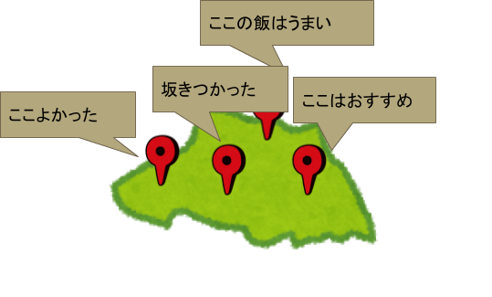
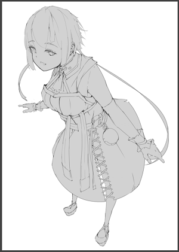
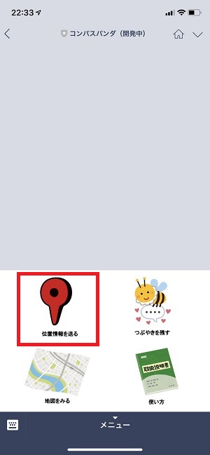
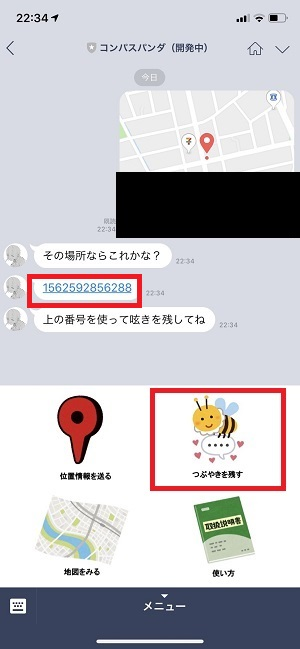
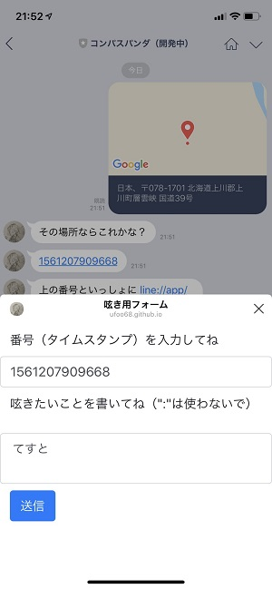
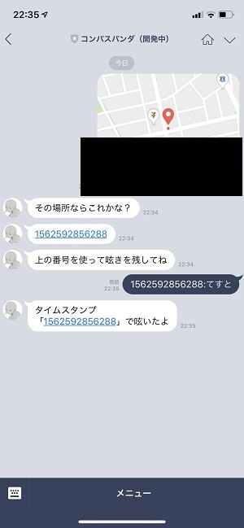
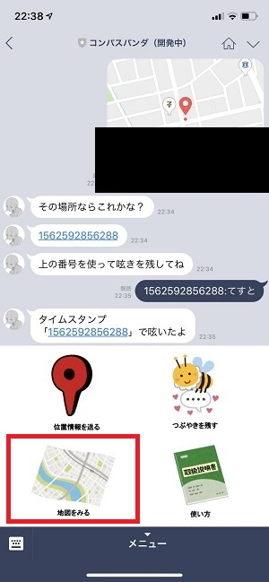
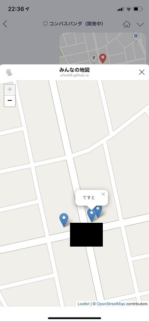
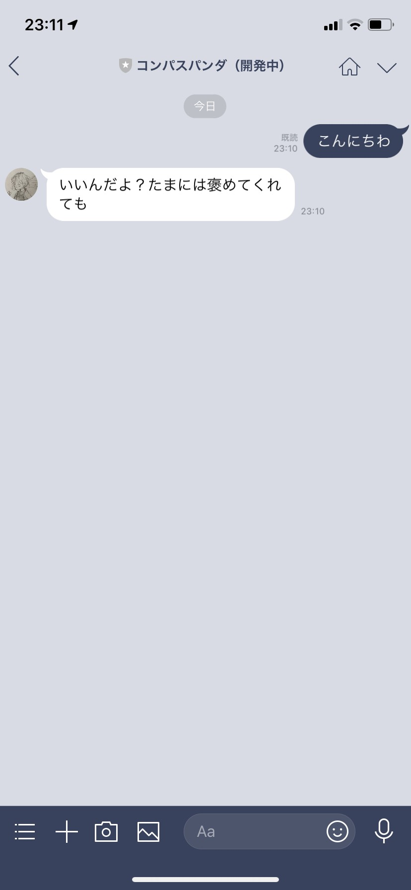

# はじめに
このレポジトリはLINE Bot「コンパスパンダ」のソースコードが保管されています。

# コンパスパンダについて
コンパスパンダは**その時・その場所**で思ったみんなの**呟き**を残すためのLINE Botサービスです。  

このようにしてみんなの呟きが地図の上に現れることで、一つの地図アプリになっていきます。そして、後からその地域にやってくる人を案内するための**コンパス**が完成されていきます。

イメージキャラクターです。このお姉さんがコンパスパンダの案内をしてくれます。

# Botの使い方
  
友達追加はこのQRコードからできます。  
登録ができたら早速トーク画面を開いてください。 

  

そしたら早速呟いてみたいので、**位置情報を送信**してみます。赤枠のところをタップして位置情報を送信します。 

  

位置情報を送信すると、色々とメッセージが送られてきます。「呟きを残す」をタップしてみましょう。
このとき赤枠内で示している数字が**自分の位置情報**と**呟き**の情報を紐づけるためのキーとなるので、そのまま番号（ここでは**タイムスタンプ**と呼んでいます）をコピーをしてください。  

  

フォームが開いたら、先ほどコピーした**タイムスタンプの番号**を上の欄に、**呟きたいこと**を下のテキストエリアに入力してそのまま「送信」を押して下さい。送信に成功すればそのままフォームが自動で閉じられます。閉じられなかった場合は送信に失敗しているので、お手数ですがもう一度入力をして送信してください。  
このときテキストエリアには「:」の文字が入らないようにしてください。システムの特性上、「:」が呟きのフォームに含まれていると、テキストの送信に成功しても**コンパスパンダが「呟き」として認識してくれません**    

  

呟きの送信に成功すると↑のようなメッセージが送られてきます。

  

そのまま呟きを確認したいので、今度はリッチメニューに戻ります。「地図を見る」をタップしてください。  

  

そのまま地図が現れてくると思います。先ほど**呟きを残した**場所に立っているマーカーをタップしてみると呟きが確認できます。  

## こぼれ話

  

コンパスパンダは普通のLINE Botなのでおしゃべりチャット機能もあります。何かしらのメッセージを送ってみると返事を返してくれます。  
また、**ある特定の言葉**が含まれたメッセージをおくるとレアな返事を返してくれるときも...?

# 技術的なお話
LINE Botの開発にはLINE株式会社が提供する[Messaging API](https://developers.line.biz/ja/services/messaging-api/)と[line-bot-sdk-nodejs](https://github.com/line/line-bot-sdk-nodejs)を使いました。また、LINEのトーク画面上に現れる**フォーム画面**と**地図**は[LIFF](https://developers.line.biz/ja/docs/liff/overview/)という仕組みが用いられています。フォーム画面のソースコードは[ここ](https://github.com/ufoo68/compassPandaForm)に、地図表示のソースコードは[ここ](https://github.com/ufoo68/compass-panda-leaflet)に保管されています。  
詳しい解説は[ここの記事]()で解説しています（準備中）。